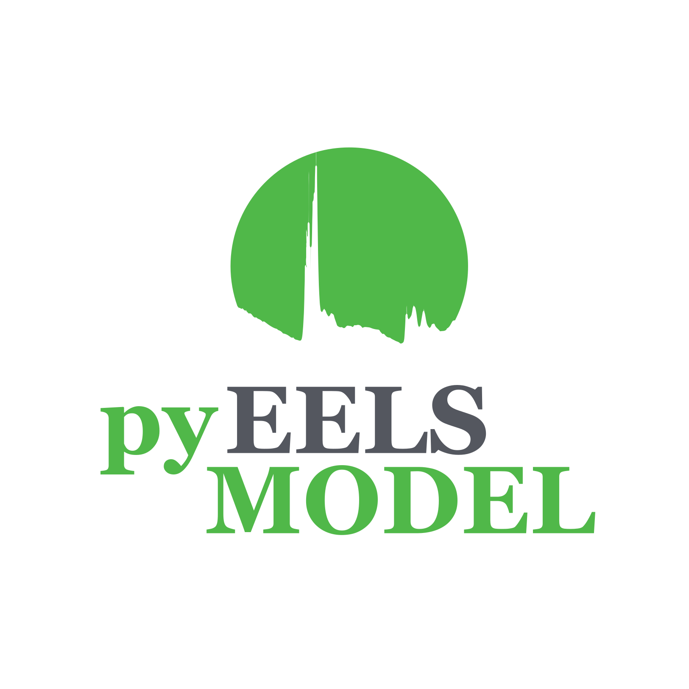

[](https://www.gnu.org/licenses/gpl-3.0)
[](https://doi.org/10.5281/zenodo.10992986)


<p align="center">

</p>

# pyEELSMODEL
pyEELSMODEL is a electron energy loss spectroscopy software based on the former [c++ software](https://github.com/joverbee/eelsmodel).
This software uses the model-based approach to quantify EEL spectra. 

See [https://pyeelsmodel.readthedocs.io/](https://pyeelsmodel.readthedocs.io/) for more information.

Installing
----------
The easiest way to install pyEELSMODEL is through the [release](https://pypi.org/project/pyEELSMODEL/) hosted on PyPI:
``` bash
pip install pyEELSMODEL
```
or by first cloning this repository to your
computer via:
``` bash
git clone https://github.com/joverbee/pyEELSMODEL.git
```
and then navigate to the pyEELMODEL directory and type 
following into the command line:
``` bash
pip install .
```
If you want to create an editable install one needs to do following:
``` bash
pip install -e .
```

When they are first needed, the generalized oscillator strengths (GOS) tables will be automatically imported.
The GOS tables are necessary to perform EEL quantification since they are used
to calculate the atomic cross sections. Two different GOS tables can be used for quantification: 
1. The GOS calculated by Zhang Z. *et al.* which can be found at doi:[10.5281/zenodo.7729585](https://doi.org/10.5281/zenodo.7729585).
2. The GOS calculated by Segger L. *et al.* which can be found at doi:[10.5281/zenodo.7645765](https://doi.org/10.5281/zenodo.7645765).

The GOS tables can also be manually imported. To know in which directory your pyEELSMODEL package is installed, following command can be run
in a python console:

``` python
import pyEELSMODEL
print(pyEELSMODEL.__path__)
```
This information is necessary for the proper use of the GOS tables.


#### GOS tables from Zhang Z.
Following steps explain how to manually setup the GOS array of 
Zhang Z. 
1. Download the Dirac_GOS_database.zip file
2. Unzip the file
3. Copy the *.hdf5 files in the folder to .pyEELSMODEL\database\Zhang folder which is found in the pyEELSMODEL folder


#### GOS tables from Segger L.
Following steps explain how to manually setup the GOS array of 
Segger L.
1. Download the Segger_Guzzinati_Kohl_1.5.0.gosh (depends on version) file
2. Copy the .gosh file to .pyEELSMODEL\database\Segger_Guzzinati_Kohl folder which is found in the pyEELSMODEL folder

**The GOS tables are used in the quantification workflows so they are necessary to run the example notebooks, but they should be automatically installed the first time they are needed.**


Using
-----
```python
import pyEELSMODEL.api as em
import numpy as np

size=1024
offset = 100 #[eV]
dispersion = 0.5 #[eV]

specshape = em.Spectrumshape(dispersion, offset, size)
data_array = np.random.random(size)

s = em.Spectrum(specshape, data=data_array)
s.plot() 
```
**For more examples on how to use pyEELSMODEL, check the ./examples folder.**\
This folder has many examples on how to use the pyEELSMODEL package.  

License
-------
The project is licensed under the GPL-3.0 license


